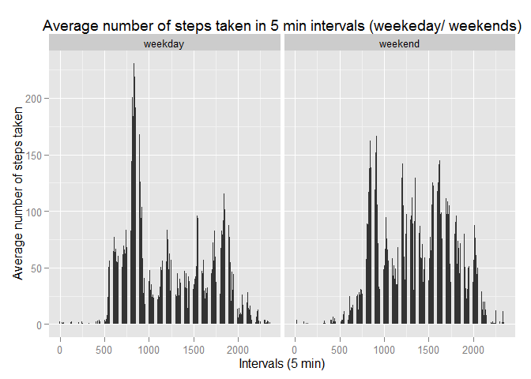

# Reproducible Research: Peer Assessment 1
Rafael Alarcon Borghi  
17-May-2015  
<br>

### Preparation
echo = TRUE (so, someone else will be able to read the code)<br>
<br>
<b>Loading "ggplot2" library</b>

```r
if (!require("ggplot2")) {
        install.packages("ggplot2")
}
```

```
## Loading required package: ggplot2
```

```
## Warning: package 'ggplot2' was built under R version 3.1.3
```

```r
require("ggplot2")
```
<br>
<b>Loading "plyr"</b>

```r
if (!require("plyr")) {
        install.packages("plyr")
}
```

```
## Loading required package: plyr
```

```
## Warning: package 'plyr' was built under R version 3.1.3
```

```r
require("plyr")
```
<br>
<b>Setting Work directory</b>

```r
setwd("~/R/repdata-014/RepData_PeerAssessment1")
```
<br><br>

## Loading and preprocessing the data
### 1.1 - Load the data (i.e. read.csv())
<b>Assuming that the file 'activity.csv' is ready, load the file into an variable, setting up each classes of the columns. <br>
It's necessary to unzip the file into the working directory.</b>

```r
arquivo <- read.csv("activity.csv", colClasses = c("integer", "Date", "factor"))
```
<br>

### 1.2 - Process/transform the data (if necessary) into a format suitable for your analysis
<b>Removing NA values</b>

```r
arquivoSemNA <- na.omit(arquivo)
```
<b>Splitting the Date into 'Day', 'Month' and 'Year' columns</b>

```r
arquivoSemNA$dia <- as.numeric(format(arquivoSemNA$date, "%d"))
arquivoSemNA$mes <- as.numeric(format(arquivoSemNA$date, "%m"))
arquivoSemNA$ano <- as.numeric(format(arquivoSemNA$date, "%Y"))
```
<b>Re-starting row numbering</b>

```r
rownames(arquivoSemNA) <- 1:nrow(arquivoSemNA)
```
<br><br>

## What is mean total number of steps taken per day?
<b>For this part of the assignment, you can ignore the missing values in the dataset.</b><br>

### 2.1 - Make a histogram of the total number of steps taken each day

```r
grafico <-      
        ggplot(arquivoSemNA, aes(x = date, y = steps)) +
        geom_bar(stat = "identity") +
        xlab("Month & Day") + 
        ylab("Total number of steps") + 
        ggtitle("Total number of steps taken each day")
print(grafico)
```

 

### 2.2 -  Calculate and report the mean and median total number of steps taken per day
<b>Calculating total number of steps taken per day</b>

```r
SomaSteps <- ddply(
        arquivoSemNA
        ,c("date")
        ,summarise
        ,steps = sum(steps)
)
```
<b>Mean of total number of steps taken per day</b>

```r
mean(SomaSteps$steps)
```

```
## [1] 10766.19
```

```r
Media <- mean(SomaSteps$steps)
```
<b>Median of total number of steps taken per day</b>

```r
median(SomaSteps$steps)
```

```
## [1] 10765
```

```r
Mediana <- median(SomaSteps$steps)
```
<br><br>

## What is the average daily activity pattern?
### 3.1 - Make a time series plot (i.e. type = "l") of the 5-minute interval (x-axis) and the average number of steps taken, averaged across all days (y-axis)
<b>Calculating average number of steps taken in each 5 min intervals</b>

```r
MediaSteps <- ddply(
        arquivoSemNA
        ,c("interval")
        ,summarise
        ,media = mean(steps)
)
```
<b>Changing the class of interval to numeric</b>

```r
MediaSteps$intervalo <- as.numeric(as.character(MediaSteps$interval))
```
<b>Ploting the results</b>

```r
grafico <-      
        ggplot(MediaSteps, aes(x = intervalo, y = media)) +
        geom_line(color = "green") +
        xlab("Intervals (5 min)") + 
        ylab("Average number of steps taken") + 
        ggtitle("Average number of steps taken in 5 min intervals")
print(grafico)
```

 

### 3.2 - Which 5-minute interval, on average across all the days in the dataset, contains the maximum number of steps?
<b>Verifying if the max value of the mean in the 'MediaSteps' data set<b>

```r
MediaSteps[MediaSteps$media == max(MediaSteps$media), ]
```

```
##     interval    media intervalo
## 272      835 206.1698       835
```
<br><br>

## Imputing missing values
<b>Note that there are a number of days/intervals where there are missing values (coded as NA). The presence of missing days may introduce biasinto some calculations or summaries of the data.</b><br>

### 4.1 - Calculate and report the total number of missing values in the dataset (i.e. the total number of rows with NAs)

```r
sum(is.na(arquivo))
```

```
## [1] 2304
```
<br>

### 4.2 - Devise a strategy for filling in all of the missing values in the dataset. The strategy does not need to be sophisticated. For example, you could use the mean/median for that day, or the mean for that 5-minute interval, etc.
####ANSWER: I would recommend to fill out the missing values (NA) of the dataset with mean of the corresponding 5 min interval.
<br>

### 4.3 - Create a new dataset that is equal to the original dataset but with the missing data filled in.
<b>Creating a new dataset...</b>

```r
NApreenchido <- arquivo
```
<b>Using the previous dataset with the calculated mean, apply it to the new created dataset</b>

```r
for (i in 1:nrow(NApreenchido)) {
        ## If find a 'NA' value
        if (is.na(NApreenchido$steps[i])) {
                ## Fill it with the calculated mean
                NApreenchido$steps[i] <- MediaSteps[which(NApreenchido$interval[i] == MediaSteps$interval), ]$media
        }
}
```
<br>

### 4.4 - Make a histogram of the total number of steps taken each day and calculate and report the mean and median total number of steps taken per day. Do these values differ from the estimates from the first part of the assignment? What is the impact of imputing missing data on the estimates of the total daily number of steps?
<b>Histogram of the total number of steps taken each day</b>

```r
grafico <-      
        ggplot(NApreenchido, aes(x = date, y = steps)) +
        geom_bar(stat = "identity") +
        xlab("Month & Day") + 
        ylab("Total number of steps") + 
        ggtitle("Total number of steps taken each day")
print(grafico)
```

 
<br>
<b>Calculating new total number of steps taken per day</b>

```r
SomaSteps2 <- ddply(
         NApreenchido
        ,c("date")
        ,summarise
        ,steps = sum(steps)
)
```
<b>New mean of total number of steps taken per day</b>

```r
mean(SomaSteps2$steps)
```

```
## [1] 10766.19
```

```r
NMedia <- mean(SomaSteps2$steps)
```
<b>New median of total number of steps taken per day</b>

```r
median(SomaSteps2$steps)
```

```
## [1] 10766.19
```

```r
NMediana <- median(SomaSteps2$steps)
```
<b>Results</b>

```r
NMedia - Media
```

```
## [1] 0
```

```r
NMediana - Mediana
```

```
## [1] 1.188679
```
####ANSWER: The values differs a little bit. The means are the same in both cases but the median in the new dataset is greater than in the 'old' one.
<br>

## Are there differences in activity patterns between weekdays and weekends?
<b>For this part the weekdays() function may be of some help here. Use the dataset with the filled-in missing values for this part.</b><br>

### 5.1 - Create a new factor variable in the dataset with two levels -- "weekday" and "weekend" indicating whether a given date is a weekday or weekend day.
<b>Creating the new column with the name of the week days.</b>

```r
NApreenchido$tipodia <- factor(format(NApreenchido$date, "%A"))
```
<b>Grouping the week days into the 2 levels: "weekday" and "weekend"</b><br>

<span style="color:red"><b>WARNING: As the default language of my computer is 'Portuguese', all the names of week days are in this language. Change it for the correct match of the current language of your system.</b></span>

```r
levels(NApreenchido$tipodia) <- list(
         weekday = c("segunda-feira", "terça-feira", "quarta-feira", "quinta-feira", "sexta-feira")
        ,weekend = c("sábado", "domingo")
)
```
<br>

### 5.2 - Make a panel plot containing a time series plot (i.e. type = "l") of the 5-minute interval (x-axis) and the average number of steps taken, averaged across all weekday days or weekend days (y-axis).
<b>Calculating average number of steps taken in each 5 min intervals</b>

```r
MediaSteps2 <- ddply(
        NApreenchido
        ,c("interval", "tipodia")
        ,summarise
        ,media = mean(steps)
)
```
<b>Changing the class of interval to numeric</b>

```r
MediaSteps2$intervalo <- as.numeric(as.character(MediaSteps2$interval))
```
<b>Ploting the results</b>

```r
grafico <-      
        ggplot(MediaSteps2, aes(x = intervalo, y = media)) +
        geom_bar(stat = "identity") +
        xlab("Intervals (5 min)") + 
        ylab("Average number of steps taken") +
        ggtitle("Average number of steps taken in 5 min intervals (weekeday/ weekends)") +
        facet_grid(. ~ tipodia, scales = "free")
print(grafico)
```

 
